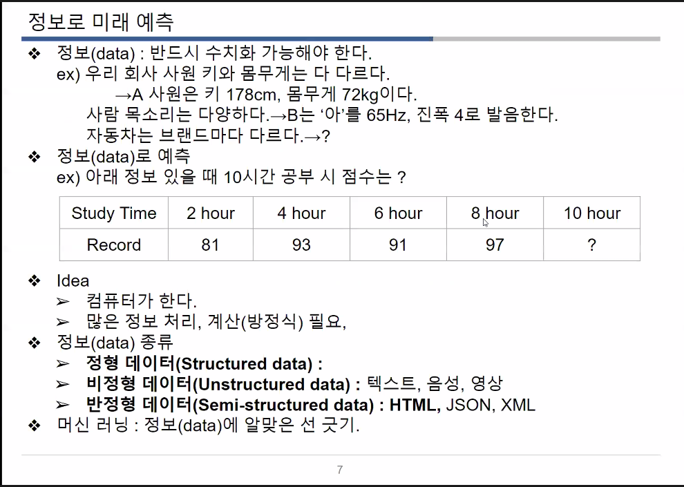

# 머신러닝 수업

## 1. 정보 단계: 수집, 가공

* 문제 데이터 확인 및 처리
* 


## 2. 교육 단계 : 머신 대상

* 컬럼 선택
* model 선택
* 교육
* 정확도 확인


## 3. 서비스 단계 : 고객 응대


### *읽으면 좋은 책 !!!*


* 한번 읽어보기

[책 구매 링크](http://book.interpark.com/product/BookDisplay.do?_method=detail&sc.prdNo=212474448&gclid=Cj0KCQjw5uWGBhCTARIsAL70sLJRp9f4uOPxqeJ2dsEuSYb7xlUGRFqT6N9CjZDBnPEXYnSqtgVdrXYaAhSTEALw_wcB)

### *머신러닝의 기초를 이해할 수 있는 사진 !!*



* 딥러닝과 머신러닝의 차이:
  * 머신러닝이 좀더 포괄적인 부분임.


## sklearn.linear 배우기!

[기초머신러닝](https://scikit-learn.org/stable/modules/generated/sklearn.linear_model.LinearRegression.html)

```python
!python -m pip install sklearn;
%load_ext autoreload;
%autoreload 2;

import sklearn;
import pandas as pd;

!dir .\files\auto-mpg.csv; ## \안에는 파일 경로!
pd_data= pd.read_csv('./files/auto-mpg.csv', header=None);
pd_data.columns = ['mpg','cylinders','displacement','horsepower','weight',
              'acceleration','model year','origin','name'];

x=pd_data[['weight']];
y=pd_data[['mpg']];
from sklearn.linear_model import LinearRegression;
lr=LinearRegression();

lr.fit(x,y);    # x,y를 갖고 1차원 리니어 함수를 만듬.
lr.coef_;       # x앞 계수
lr.intercept_;  # y절편
# 즉, y= -0.00767661x + 46.31736442이 됨..
lr.score(x,y);  # 결과.
```

* 위는 고전적 머신러닝을 이야기함.

* !dir .\files\auto-mpg.csv --> 파이썬 파일형식이 아니니 앞에 !붙임 (jupyter 기준)


* 수치예측 : LinearRegression
* 범주예측: 아직 안배움


* ##### 데이터 머신러닝을 교육시켰지만, 실제 머신러닝이 갖고 있는것은 `coef, intercept`를 가지고 있음.

* ##### 또한 score를 검증해야 하기 떄문에 원래 자료를 %를 나눠서 스플릿을 시켜서 학습 시키는 부분 그리고 확인하는 부분으로 나눠야 한다.

  * ```python
    from sklearn.model_selection import train_test_split;
    X_train, X_test, Y_train, Y_test = train_test_split(x,y);
    # 머신러닝에 학습을 위해 넣는 부분이 (train)부분
    # 머신러닝이 학습을 하고 난 후 테스트를 하기위한 부분이 (test)부분
    # 또한 split을 하면 100개로 쪼개짐.
    X_train.shape, X_test.shape, Y_train.shape, Y_test.shape;
    # 이렇게 되면 변수가 바뀌게 됨
    # lr.fit(x,y)  -> lr.fit(X_train,Y_train)
    lr.fit(X_train,Y_train);
    # lr.coef_ 이 값 또한 바꿔줘야함.
    lr.coef_, lr.intercept_  # 두개를 넣어주고,
    lr.coef_, lr.intercept_  # 결과를 확인하면 값이 달라진다.
    # 즉 직선(리니어) 머신러닝 셋은 데이터에 따라 값이 달라진다.
    ```

  * 

  * 위에 그림처럼 스플릿을 한다.(2x 와 1y에 대해서)
  * 결과는 2개의 coef가 나오게 됨.
  * 
  *  행렬내용 [1강 강의록 업로드 (1).pdf](E:\chs_2020\study\멀티캠퍼스\빅데이터기반지능형서비스개발수업\1강 강의록 업로드 (1).pdf) 
  * 


